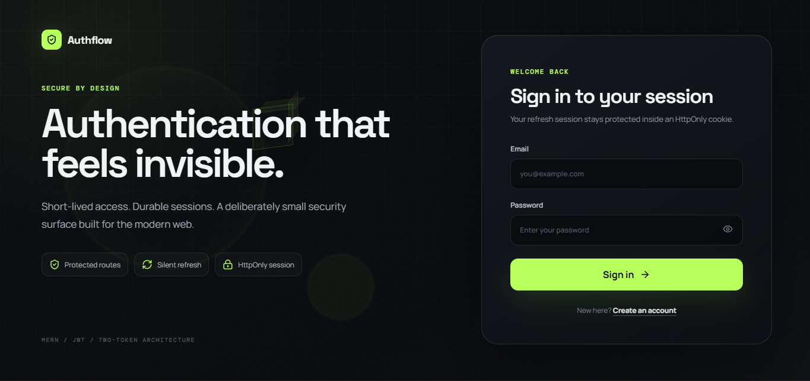
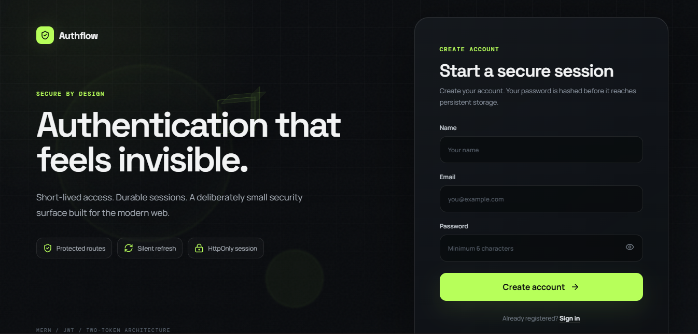
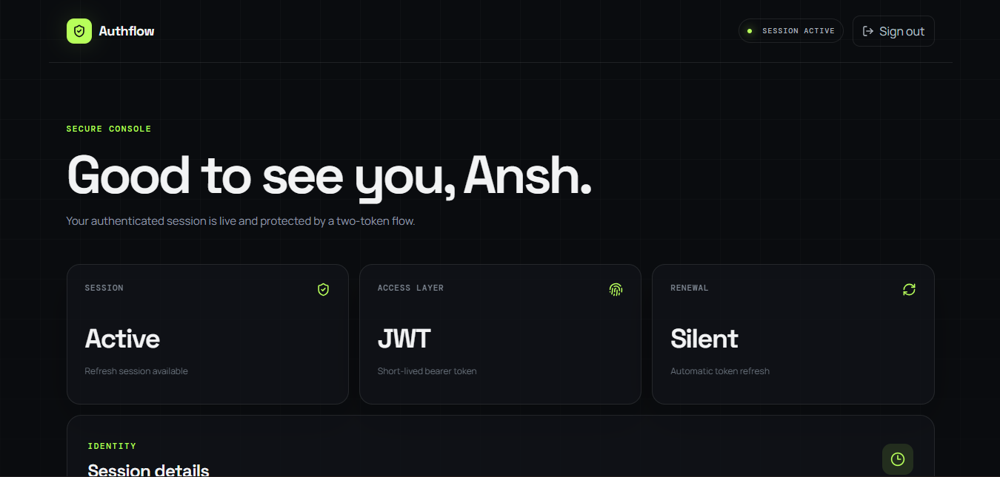
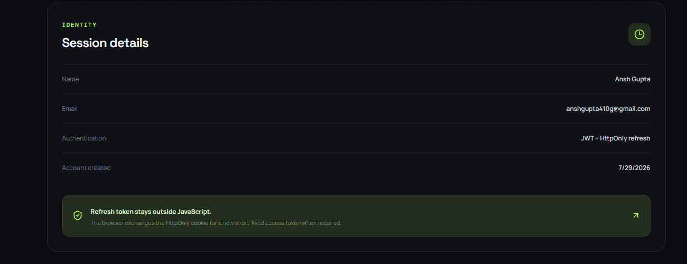

# 🔐 AuthFlow - MERN Authentication System

A modern, secure authentication system built with the MERN stack featuring JWT authentication, Refresh Tokens, HttpOnly Cookies, and a beautiful responsive UI.

## 🌐 Live Demo

**Website:** assessment-ten-pied.vercel.app

---

# ✨ Features

### Authentication
- User Registration
- User Login
- Secure Logout
- Protected Dashboard
- JWT Access Token Authentication
- Refresh Token Authentication
- Automatic Access Token Refresh
- Persistent User Sessions
- Password Hashing with bcrypt

### Security
- Access Token (15 minutes)
- Refresh Token (7 days)
- HttpOnly Cookies
- Secure Password Storage
- Protected API Routes
- CORS Configuration
- Environment Variable Protection

### User Experience
- Modern Animated UI
- Responsive Design
- Smooth Page Transitions
- Loading States
- Error Handling
- Automatic Session Recovery

---

# 🛠 Tech Stack

## Frontend

- React
- Vite
- React Router DOM
- Axios
- Motion
- Lucide React
- CSS3

## Backend

- Node.js
- Express.js
- MongoDB Atlas
- Mongoose
- JWT
- bcryptjs
- cookie-parser
- cors
- dotenv

## Deployment

- Vercel (Frontend)
- Vercel (Backend)
- MongoDB Atlas

---

# 📁 Project Structure

```
authflow/
│
├── client/
│   ├── src/
│   │   ├── components/
│   │   ├── context/
│   │   ├── pages/
│   │   ├── services/
│   │   ├── App.jsx
│   │   └── main.jsx
│   │
│   ├── public/
│   └── package.json
│
├── server/
│   ├── config/
│   ├── controllers/
│   ├── middleware/
│   ├── models/
│   ├── routes/
│   ├── utils/
│   ├── server.js
│   └── package.json
│
└── README.md
```

---

# 🔄 Authentication Flow

```
User Login
      │
      ▼
Validate Credentials
      │
      ▼
Generate Access Token (15 min)
      │
      ▼
Generate Refresh Token (7 days)
      │
      ▼
Store Refresh Token in HttpOnly Cookie
      │
      ▼
Return Access Token
      │
      ▼
Access Protected Routes
      │
      ▼
Access Token Expires
      │
      ▼
/auth/refresh
      │
      ▼
New Access Token Generated
```

---

# 🔐 Authentication Strategy

### Access Token

- JWT
- 15-minute expiration
- Stored in React state
- Used for protected API requests

### Refresh Token

- JWT
- 7-day expiration
- Stored in HttpOnly Secure Cookie
- Automatically refreshes expired access tokens

---

# 🚀 Installation

## Clone Repository

```bash
git clone https://github.com/Anshgupta885/Assessment.git

cd YOUR_REPO
```

---

## Backend Setup

```bash
cd server

npm install

npm run dev
```

---

## Frontend Setup

```bash
cd client

npm install

npm run dev
```

---

# 🔑 Environment Variables

## Backend (.env)

```env
PORT=5000

MONGO_URI=your_mongodb_connection_string

ACCESS_TOKEN_SECRET=your_access_secret

REFRESH_TOKEN_SECRET=your_refresh_secret

ACCESS_TOKEN_EXPIRES_IN=15m

REFRESH_TOKEN_EXPIRES_IN=7d

CLIENT_URL=http://localhost:5173
```

---

## Frontend (.env)

```env
VITE_API_URL=http://localhost:5000/api
```

---

# 📡 API Endpoints

## Authentication

| Method | Endpoint | Description |
|---------|----------|-------------|
| POST | /api/auth/register | Register User |
| POST | /api/auth/login | Login User |
| POST | /api/auth/refresh | Refresh Access Token |
| POST | /api/auth/logout | Logout User |

---

## User

| Method | Endpoint | Description |
|---------|----------|-------------|
| GET | /api/user/me | Get Logged-in User |

---

# 🔒 Security Features

- Password hashing using bcrypt
- JWT Authentication
- Refresh Token Rotation
- HttpOnly Cookies
- Secure Cookie Configuration
- Protected Routes
- Environment Variables
- CORS Protection

---

# 🏗 Architecture

```
            React Frontend
                  │
                  │ Axios
                  ▼
           Express REST API
                  │
        JWT Authentication
                  │
                  ▼
           MongoDB Atlas
```

---

# 📸 Screenshots

## Login Page



---

## Register Page



---

## Dashboard




---
### Protected Dashboard



---
# 📈 Future Improvements

- Email Verification
- Forgot Password
- Google Authentication
- Role-Based Authorization
- Two-Factor Authentication (2FA)
- User Profile Management

---

# 🤖 AI Assistance

This project was developed with assistance from **ChatGPT (GPT-5.5)** for:

- Project planning
- Authentication architecture
- JWT implementation
- Refresh Token strategy
- Deployment troubleshooting
- Documentation

All code was reviewed, integrated, tested, and modified as required before deployment.

---

# 👨‍💻 Author

**Ansh Gupta**

GitHub: https://github.com/Anshgupta885

LinkedIn: https://www.linkedin.com/in/ansh-gupta-75a0aa355/

---

# 📄 License

This project is developed for educational and internship assessment purposes.